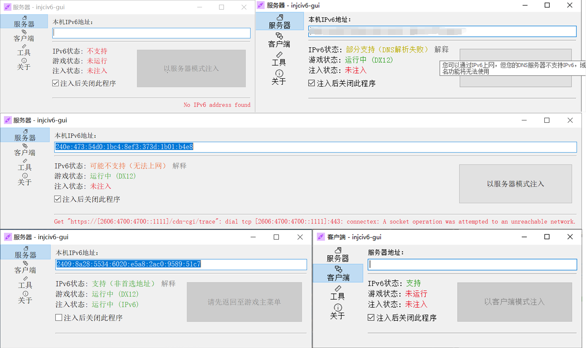

# 文明6联机-基于IP的游戏发现 (IPv4/IPv6)

> 改自：Hook文明6游戏sendto函数dll和注入程序
>
> 原作者仓库：[https://gitcode.net/PeaZomboss/miscellaneous](https://gitcode.net/PeaZomboss/miscellaneous)

公网 UDP 单播联机，不再需要虚拟局域网！

利用 Hook 技术，拦截游戏对 UDP 的发送、接收等操作，实现基于 IP 的游戏发现和联机

至此，文明6联机不再需要诸如 n2n, OpenVPN, Hamachi 等虚拟局域网，直接公网联机！

主要实现以下两点

- 拦截客户端发现服务器时发出的 UDP 广播包，将其改为单播到指定服务器 IP，实现稳定的游戏发现 (IPv4/IPv6)
- 对于 IPv6
  - 重定向对 `0.0.0.0` 的监听到 `[::0]`
  - 建立 FakeIP 表，将 IPv6 地址映射到 `127.0.127.1 ~ 127.0.127.100` 并提供给 文明6 虚假的 IPv4 地址 (实现原理同 Clash 的 FakeIP)

想了解程序原理的可以看下面的[原理简述](#原理简述)

可用系列：

- injbg3: 适用于 博德之门3 游戏的联机工具，详见 injbg3 分支

## 使用方法

**注入工具由于涉及创建远程线程操作，Windows Defender 大概率会报毒，把 Windows Defender 关了再运行吧**

========================= **使用 injciv6-gui 工具** ================================

先启动游戏，然后双击 `injciv6-gui.exe` 打开图形界面。

### 进行 IPv6 连接时

在服务端，选择【服务器】模式，告诉其他玩家本机的 IPv6 地址，然后点击【以服务器模式注入】按钮。

在客户端，选择【客户端】模式，在【服务器地址】中填写服务端的 IPv6 地址，然后点击【以客户端模式注入】按钮。

注入状态显示为【已注入】时，即可开始游戏。

### 进行 IPv4 连接时

需要先行搭建虚拟局域网，服务端无需注入。

在客户端，选择【客户端】模式，在【服务器地址】中填写服务端的 IPv4 地址，然后点击【以客户端模式注入】按钮。

### 说明

IPv6状态以下几种：

- 【不支持】：本机不支持 IPv6，检查IPv6设置，如适配器是否勾选了 IPv6 协议。
- 【可能不支持（无法上网）】：在本地发现 IPv6 单播地址，但是无法连接到互联网，检查互联网连接是否正常。（除非你想用 IPv6 进行局域网联机）
- 【部分支持（DNS解析失败）】：在本地发现 IPv6 单播地址，且可以连接到互联网，但是由于 DNS 不支持 IPv6，请不要在【服务器地址】中填写 IPv6 域名，只应当填写 IP 地址。
- 【支持（非首选地址）】：在本地发现 IPv6 单播地址，且可以连接到互联网，DNS 也支持 IPv6，但是 IPv6 地址不是首选地址，在【服务器地址】中填写 IPv4/IPv6 双栈域名有可能会导致连接失败。
- 【支持】：IPv6完全受支持，但是您仍然可能需要自行检查防火墙设置。

### 疑难解答

- Q: 为什么我注入时显示“注入失败”？

  A: 最常见的原因是“拒绝访问”，若您以管理员身份注入仍然失败，大概率是您的杀毒软件在内核层面拦截了注入操作，请尝试关闭杀毒软件后再次注入。

- Q: 为什么我注入后，游戏崩溃了？

  A: 如果您是启动游戏后第一次注入后，经过特定操作后，能稳定复现崩溃，那么请加群反馈 BUG。

- Q: 为什么我解除注入后，游戏崩溃了？

  A: 请不要在游戏中，或者游戏房间，或者非游戏主菜单以外的界面解除注入。

- Q: 为什么我注入后，无法发现房间？

  A: 最有可能的原因是您的防火墙阻止了游戏的网络连接，可以尝试先关闭 Windows 防火墙，如果不行，则可能是路由器或运营商的防火墙。

  - 让作客户端的玩家尝试 ping 服务器地址，如果 ping 不通，则说明服务器侧防火墙阻止了连接。（服务器侧需要关闭防火墙）

  - 同时，作为服务器的玩家也可以尝试 ping 客户端的地址，如果 ping 不通，则说明可能是客户端侧防火墙阻止了连接。（取决于防火墙类型，默认情况客户端不需要关闭防火墙）

- Q: 为什么我注入后，能发现房间，但是一直卡在“正在检索创建人信息”？

  A: 请按照上一条的方法检查防火墙设置。但也不排除是游戏版本/DLC不一致导致的问题，尝试调整房间设置后再次尝试。

- Q: 为什么我能正常发现房间，也可以正常加入房间，但是3个人及以上无法同时加入游戏？

  A: 这是一个已知的奇怪问题，如果您使用的是 IPv4 公网联机，暂时没有很好的解决方案。如果您使用的是 IPv6 公网联机，可以在服务端使用 >=v0.3.3 版本的 injciv6-gui工具。如果更改版本后客户端侧变为了无法发现房间，可以尝试在客户端使用 <=v0.3.2 版本的 injciv6-gui工具。(有待解决)

========================= **直接使用原始注入工具** ==============================

双击 `injciv6.exe` 自动注入正在运行的 文明6 进程（一个进程不要多次注入）

双击 `civ6remove.exe` 解除注入

第一次注入后，会在 文明6 目录下生成一个 `injciv6-config.txt` 文件，用于配置要连接的服务器地址。

`injciv6-config.txt` 文件默认只有一行，初始为 `255.255.255.255`

请改成要连接的服务器地址，如 `192.168.1.100`, 或 `2001::1234:5678:abcd:ef01`, 或 `abc.com` 等

要使配置生效，请再次双击 injciv6.exe 根据提示重新注入。

然后就可以使用基于 IP 的游戏发现功能了。

**如果发现不了房间，尝试关闭 Windows 防火墙，以及检查路由器防火墙是否放通**

- 当使用 ipv4 联机时，一般在客户端上进行注入，配置成服务器的 ipv4 地址即可。服务端无需注入
- 当使用 ipv6 联机时，在客户端注入并配置成服务器的 ipv6 地址的同时。服务端也需要注入，理论上地址可以任意 ipv6 地址，一般建议填 `::0` 。

注：文明6 目录一般为 `\Sid Meier's Civilization VI\Base\Binaries\Win64Steam` 或 `\Sid Meier's Civilization VI\Base\Binaries\Win64EOS`

仅支持 Windows 下的 x86 和 x64 平台 (x86 没测过)

================= **使用更原始的注入工具（也许你想对其他游戏进行注入）** =================

也可以单独运行 `injector32.exe` 或者 `injector64.exe` 注入

例如你要注入文明6，那么请使用 `injector64.exe -x=CivilizationVI.exe` 或者 `injector64.exe -x=CivilizationVI_DX12.exe`

如果游戏以管理员权限运行，injector也要以管理员权限运行

## 目录说明

- bin存放编译后的二进制文件输出目录
- inc存放头文件
- src存放源代码
- hookdll存放dll的代码和Makefile
- injector存放注入程序的代码和Makefile
- injciv6存放注入程序的代码和Makefile
- injciv6-gui存放图形界面程序的代码和Makefile

## 编译方法

首先确保同时安装了x86和x64的*MinGW-w64*工具链，已经有的可以略过
下载地址<https://github.com/niXman/mingw-builds-binaries/releases>  
注意要下载两个，一个带**i686**前缀，一个带**x86_64**前缀  
将它们分别解压到不同目录，然后将二者的bin目录都设置环境变量

> xaxys:
>
> 下载上面的两个压缩包，一个解压到本文件夹下的 mingw32, 一个解压到本文件夹下的 mingw64
>
> 然后运行 env.bat, 会自动设置环境变量, 开箱即用

当然如果你用msys2也可以，会配置完全没问题

切换工作目录到当前目录，运行`mingw32-make`即可  
如果你单独安装了*GNU make*，那么可以直接运行`make`

---

要编译 injciv6-gui，需要安装 Go 语言环境，然后按原样使用 `make` 即可

## 原理简述

### 游戏发现

文明6原游戏发现机制是：

1. 点击刷新后，客户端向局域网发送 `eth.dst=ff:ff:ff:ff:ff:ff && ip.dst=255.255.255.255` 的 UDP 广播包，端口从 `62900` 到 `62999`。共发送 100 个包。包大小一般为 4 字节。

1. 服务器通常在 `62900` 端口监听，收到广播包后，向客户端回复多个大小为 1104 字节的 UDP 单播包，包含服务器信息，格式主要是 `json`, 包含房间信息。

1. 客户端在发送的端口上监听，此时可能会收到服务器回复。不管收没收到，很短的一段时间后，关闭该 Socket。

本程序的原理是：

1. 通过 Hook 程序 `sendto` 函数，在客户端发出 UDP 广播包时，将其改为单播到指定服务器 IP，端口不变。

    - 发送时，建立 Socket 替换表，并建立新的 IPv4 或 IPv6 Socket，将其 bind 到与原 Socket 相同的端口上。
  
    - 通过替换的新 Socket 发送 UDP 单播给目标服务器 IP。

1. 通过 Hook 程序 `recvfrom` 函数，在客户端监听端口时，如果监听的端口在上述替换表中，将其改为从 Socket 替换表中的新 Socket 上接收。

    - 接收时，如果收到的地址为 IPv4 的地址，直接返回给游戏程序。
  
    - 接收时，如果收到的地址为 IPv6 的地址，建立 FakeIP 表，将 IPv6 地址映射到 `127.0.127.1 ~ 127.0.127.100` (暂设) 中顺序分配的一个假 IPv4 地址，并返回给游戏程序。

1. 通过 Hook 程序 `select` 函数，在客户端 select 监听端口（等待服务器回复）时，将其改为 select Socket 替换表中的新 Socket。

### 游戏联机

如果是 IPv4 联机，完成游戏发现后，沿用原游戏联机机制即可，不再需要以下修改，以下修改仅针对 IPv6 联机。

文明6原游戏联机机制是：

1. 上述发现完成后，客户端选择联机房间后，在 `62056` 端口上打开监听，并向目标服务器 IP 的 `62056` 端口发送 UDP 单播包，首包大小一般为 120 字节。

1. 服务器收到后，向客户端 `62056` 端口发送 UDP 单播包，然后联机正常建立。

**注意：** 联机机制使用的是 `WSASendTo` 和 `WSARecvFrom` 函数，而不是 `sendto` 和 `recvfrom` 函数。

**注意：** 游戏联机时，会先 bind 后先在 `62056` 端口上 `WSARecvFrom`，然后再 `WSASendTo`。

本程序的原理是：

1. 通过 Hook 程序 `WSASendTo` 函数，在客户端发出 UDP 单播包时，查询 FakeIP 表，如果目标地址为假 IPv4 地址，则将其改为发送到对应的 IPv6 地址。

1. 通过 Hook 程序 `WSARecvFrom` 函数，操作和 `recvfrom` 函数完全一致。

1. 通过 Hook 程序 `bind` 函数，在客户端开启 `0.0.0.0:62056` 端口监听时，将其改为监听 `[::0]:62056` 端口。并写入 Socket 替换表。

**注意：** 游戏联机时，并未使用 Hook 程序 `select` 函数，而是创建了非阻塞的 Socket，然后不断进行 `WSARecvFrom` 操作，如果建立替换的新 Socket 不是非阻塞的，会导致游戏卡死。

**注意：** 游戏联机时，作为服务端的程序会在创建房间时，执行上述 2 和 3 两步，因此对于 IPv6 联机，服务端也需要注入。

## 后记

非常感谢原作者 PeaZomboss 的注入框架，也非常感谢 DawningW 大佬的帮助
